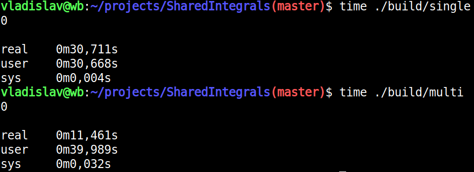

# Parallelization of integral calculation sharing memory with child processes

Build:
```
chmod +x ./build.sh
./build.sh
```
Test:
```
time ./build/single
time ./build/multi
```
Results (AMD Ryzen 3 3250U 4 cores):



In `src/functions.cpp` you can configure function you want to integrate.

Processes sync by managed_shared_memory, in which you can construct named objects and then find them.
Multiprocess conversation produced by bounded multi-produser multi-consumer blocking queue.